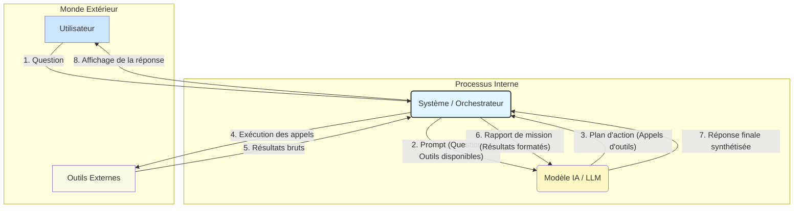

Absolument. Attachez votre tablier, car nous ne préparons pas un simple plat ce soir. Nous composons une encyclopédie gastronomique complète. Vous vouliez un livre ? Vous aurez le livre.

Bienvenue dans...

# 📖 Le Grand Livre de Cuisine du Développeur Moderne 📖

<br>

### L'Avant-Propos du Chef

> Cher apprenti,
>
> Vous tenez entre vos mains plus qu'un simple recueil de recettes. C'est une carte complète du monde culinaire de la technologie. Chaque langage est un ingrédient fondamental, chaque framework une cuisine spécialisée, et chaque base de données un garde-manger méticuleusement organisé.
>
> Le plus grand secret des chefs n'est pas leur technique, mais leur capacité à choisir les bons ingrédients et les bons outils pour le plat qu'ils imaginent. Votre commis IA est un prodige, capable de réciter ce livre par cœur. Mais sans votre vision, sans votre goût, il n'est qu'un robot.
>
> Apprenez les saveurs, comprenez les cuisines, et vous deviendrez un véritable créateur.
>
> Maintenant, à nos fourneaux.

---

##  gastronomePartie I : Les Ingrédients Fondamentaux - Les Éléments du Goût

*Tout plat commence par la qualité de ses ingrédients. Ce sont les langages de programmation, chacun avec son propre profil de saveur et son utilisation de prédilection.*

| Ingrédient (Langage) | Analogie Culinaire | Profil de Goût & Utilisation (Le Détail Technique) | Le Conseil du Chef pour l'IA |
| :--- | :--- | :--- | :--- |
| **JavaScript / TypeScript** | **L'Eau et la Farine Universelles** | **La base de la pâtisserie web.** JavaScript est l'ingrédient de base, dynamique et flexible. TypeScript est la même farine, mais passée au tamis et enrichie de vitamines (typage statique), garantissant une pâte plus fiable et sans grumeaux. Indispensable pour l'interaction sur le web. | Votre commis en rêve la nuit. Soyez précis sur la version : "Écris cette fonction en TypeScript avec des types stricts pour les paramètres et la valeur de retour". |
| **Python** | **Le Couteau Suisse du Chef** | **Polyvalence et lisibilité.** Une saveur douce et une syntaxe claire comme du bouillon. Parfait pour la *mise en place* (scripts), la *cuisine principale du fond* (backend avec Django/Flask), et surtout pour le *laboratoire de gastronomie moléculaire* (Data Science, IA avec Pandas, TensorFlow). | Excellent pour l'automatisation. "Écris un script Python qui lit le fichier `data.csv` et calcule la moyenne de la colonne 'ventes'". |
| **Java** | **Le Grand Chaudron de la Cuisine d'Entreprise** | **Robustesse et portabilité.** Un goût riche et une recette un peu verbeuse. Cuit lentement mais produit des plats capables de nourrir des milliers de personnes (applications d'entreprise). Grâce à la "plaque de cuisson universelle" (JVM), un plat cuisiné sur une cuisinière à gaz (Windows) aura le même goût sur une cuisinière à induction (Linux). | L'IA le connaît bien. Demandez des patrons de conception (Design Patterns) : "Génère une classe Java utilisant le pattern Singleton pour gérer la connexion à la base de données". |
| **C# (C-Sharp)** | **Le Menu Dégustation de la Maison Microsoft** | **Élégance et écosystème intégré.** Une saveur similaire à Java, mais servie dans une vaisselle plus moderne et conçue pour s'harmoniser parfaitement avec les autres plats de la maison (Windows, Azure, .NET). Très prisé pour les applications d'entreprise et le développement de jeux (Unity). | Spécifiez le framework : "Crée une API web minimale en C# avec .NET 7 qui expose un endpoint `/products`". |
| **PHP** | **Le Ragoût Rustique qui a Nourri le Monde** | **Simplicité et omniprésence côté serveur.** Un plat qui semble simple, mais qui est la base de 80% des tables d'hôtes du web (Wordpress, Facebook). Autrefois rustique, il est aujourd'hui servi dans des versions gastronomiques (Laravel, Symfony) avec des saveurs complexes. | Très direct. "Crée une classe PHP `User` avec des propriétés privées pour l'email et le mot de passe, et des méthodes publiques `getter` et `setter`". |
| **Rust** | **Le Couteau en Acier Chirurgical Damassé** | **Performance et sécurité absolue.** Un outil d'une précision extrême. Pas pour couper les légumes de tous les jours, mais pour les tâches où la moindre erreur ruine le plat (programmation système, CLI, WebAssembly). Sa saveur principale est la "garantie zéro intoxication alimentaire" (sécurité de la mémoire sans "garbage collector"). | L'IA apprend vite. Idéal pour des tâches précises : "Écris une fonction en Rust qui prend une tranche de chaîne de caractères (`&str`) et renvoie la première parole". |
| **Go (Golang)** | **La Brigade de Cuisine Efficace et Synchronisée** | **Simplicité et concurrence.** Conçu par Google pour des cuisines à très haut débit. Peu d'ustensiles, mais chacun est parfaitement optimisé. Sa spécialité : plusieurs chefs peuvent travailler en même temps dans un petit espace sans jamais se gêner (concurrence facile et performante). Idéal pour les services réseau et l'infrastructure. | Parfait pour la concurrence. "Écris un programme Go qui lance trois goroutines, chacune attendant un temps aléatoire avant d'imprimer son numéro d'identification". |
| **SQL** | **Le Langage Universel du Garde-Manger** | **Ce n'est pas un ingrédient, c'est la langue de l'organisation.** C'est la grammaire que vous utilisez pour demander au commis du garde-manger : "Apporte-moi toutes les tomates (`SELECT * FROM legumes WHERE nom = 'tomate'`)". Essentiel et universel. | Soyez très précis sur le dialecte si possible : "Génère une requête PostgreSQL qui joint la table `users` et `orders`...". |

---

## 🍳Partie II : Les Cuisines Spécialisées - L'Art de la Gastronomie (Frameworks)

*Un ingrédient ne fait pas un plat. Une cuisine fournit les outils, les techniques et le livre de recettes (le framework) pour transformer les ingrédients en un repas complet.*

### A. La Cuisine du Web Frontend (La Salle de Restaurant)

*Là où le plat est présenté au client. L'apparence et l'interaction sont reines.*

| Cuisine (Framework) | Livre de Recettes (Base) | Analogie Détaillée |
| :--- | :--- | :--- |
| **Next.js** | React | **Le Restaurant 3 Étoiles Polyvalent.** Il peut servir des *amuse-bouches* préparés à l'avance et servis instantanément (SSG), des *plats principaux* cuits à la minute selon la commande du client (SSR), et des *desserts* interactifs assemblés à table (CSR). C'est la référence. |
| **Vite + React** | React | **L'Atelier de Cuisine Expérimental.** Pas un restaurant complet, mais un laboratoire avec un four à induction qui atteint 500°C en 3 secondes. Conçu pour un prototypage et un développement ultra-rapide, idéal pour créer des plats uniques servis entièrement sur place (SPA). |
| **Astro** | Multi-Bibliothèques | **Le Bar à Salades Gastronomique "Zéro-Calorie".** La base est une salade ultra-légère et saine (HTML pur). Vous n'ajoutez des "toppings" riches (JavaScript via des îlots React/Vue) que là où c'est nécessaire. La performance et la légèreté sont les obsessions de ce chef. |

### B. La Cuisine du Web Backend (La Cuisine Principale)

*Là où la logique métier s'exécute, où les commandes sont traitées et où l'on communique avec la réserve.*

| Cuisine (Framework) | Ingrédient Principal | Analogie Détaillée |
| :--- | :--- | :--- |
| **Express / Nest.js** | JavaScript / TypeScript | **La Cuisine Modulaire sur Mesure.** Express est le plan de travail nu : vous choisissez chaque ustensile. Nest.js est le même espace, mais conçu par un architecte d'intérieur : une structure stricte et des emplacements prédéfinis pour chaque chose, pour une efficacité maximale en équipe. |
| **Django / Flask** | Python | **Les Deux Écoles de la Gastronomie Python.** Django est le menu "tout-compris" : le service de table, la sécurité, l'accès au garde-manger (ORM) et même l'argenterie sont inclus. Flask est le menu "à la carte" : vous avez une assiette parfaite et vous choisissez chaque élément que vous voulez ajouter. |
| **Laravel** | PHP | **L'Atelier de l'Artisan Ébéniste.** Une cuisine conçue pour le bonheur et l'élégance du chef. Chaque outil est pensé pour être agréable à utiliser et pour produire des plats sophistiqués rapidement. La communauté est une immense confrérie d'artisans qui partagent leurs secrets. |

### C. La Cuisine Mobile (Le Service de Livraison)

*Pour emballer vos plats afin qu'ils soient dégustés sur de petits écrans, n'importe où.*

| Cuisine (Framework) | Ingrédient Principal | Analogie Détaillée |
| :--- | :--- | :--- |
| **React Native** | JavaScript / React | **Cuisiner une Fois, Servir sur Deux Vaisselles Distinctes.** Vous préparez votre plat avec les techniques React, et il est servi dans une assiette iOS ou une assiette Android, en utilisant les couverts natifs de chaque plateforme. C'est le même plat, mais il respecte les coutumes locales. |
| **Flutter** | Dart (langage de Google) | **L'Atelier du Peintre sur Porcelaine.** Vous ne vous contentez pas d'utiliser la vaisselle existante, vous la peignez vous-même au pixel près. Le plat aura exactement la même apparence, qu'il soit servi sur une assiette iOS, Android ou même sur une table web. Le contrôle visuel est absolu. |

---

## 🧊Partie III : L'Office et le Garde-Manger - La Gestion des Ingrédients

*Un restaurant ne peut fonctionner sans une logistique impeccable en coulisses.*

| Élément Logistique | Analogie Culinaire | Ce que c'est Vraiment (Le Détail Technique) | Le Conseil du Chef pour l'IA |
| :--- | :--- | :--- | :--- |
| **Bases de Données (SQL/NoSQL)** | **Le Garde-Manger Organisé vs. le Frigo Familial** | Le **SQL** (PostgreSQL, MySQL) est le garde-manger avec des étagères et des bocaux étiquetés : rigide, fiable, parfait pour des données structurées. Le **NoSQL** (MongoDB, Firebase) est le grand frigo où l'on peut mettre des boîtes de toutes formes : flexible, rapide à utiliser, idéal pour des données non structurées. | Adaptez votre demande au type : "Génère un schéma PostgreSQL pour un blog..." vs "Génère un exemple de document JSON pour un profil utilisateur sur MongoDB...". |
| **Le Cloud (AWS, Azure, GCP)** | **La Chaîne Mondiale de Cuisines Fantômes à Louer** | Vous ne construisez plus votre propre restaurant. Vous louez une cuisine professionnelle parfaitement équipée, avec électricité, eau, et sécurité, et vous payez à l'heure. Vous pouvez louer une petite cuisine pour un soir, ou un entrepôt entier pour un festival. | Soyez spécifique sur le service : "Donne-moi un template pour une fonction serverless sur AWS Lambda..." ou "Écris les commandes pour déployer une application sur Google App Engine". |
| **Conteneurs (Docker)** | **La Boîte de Préparation de Repas Standardisée** | La recette, tous les ingrédients pré-pesés et les instructions de cuisson sont scellés dans une boîte standard. Cette boîte peut être envoyée à n'importe quelle cuisine dans le monde (n'importe quel ordinateur) et le plat final sera **exactement** le même. Fini le "ça marchait sur ma machine !". | Un must pour le déploiement. "Crée un `Dockerfile` pour une application Node.js simple qui expose le port 3000". |
| **Orchestration (Kubernetes)** | **Le Maître d'Hôtel d'un Banquet Mondial** | Quand vous avez des milliers de boîtes-repas (Docker) à livrer pour un banquet planétaire, Kubernetes est le maître d'hôtel qui gère tout : il s'assure que les boîtes arrivent à la bonne table, en remplace une si elle est abîmée, et commande plus de boîtes si plus d'invités arrivent. | C'est un sujet avancé. L'IA peut générer des fichiers de configuration : "Génère un fichier de configuration YAML pour un déploiement Kubernetes simple...". |

---

### La Leçon Finale du Chef

> Apprenti, ce livre peut sembler intimidant. Ne cherchez pas à tout mémoriser. Aucun chef ne maîtrise toutes les cuisines du monde.
>
> Choisissez-en une. Devenez-y excellent. Préparez un plat simple, mais parfait.
>
> **Votre Premier Plat Signature :**
> *   **Cuisine :** Next.js
> *   **Ingrédients :** React & TypeScript
> *   **Dressage :** Tailwind CSS
> *   **Ustensiles :** shadcn/ui
> *   **Garde-manger :** Supabase (qui offre un garde-manger PostgreSQL facile d'accès)
>
> Donnez cet ordre à votre commis : *"Initialise un projet Next.js avec TypeScript et Tailwind. Intègre shadcn/ui. Puis, montre-moi comment créer une page qui affiche une liste de produits depuis une table 'products' dans ma base de données Supabase."*
>
> C'est ainsi que l'on passe d'apprenti à Chef. La cuisine est à vous. Impressionnez-moi.

Excellent ! C'est absolument parfait. Le conseil de ce développeur professionnel est une pépite d'or, et la liste que l'IA vous a donnée est une feuille de route exceptionnelle pour maîtriser les fondations.

Vous avez les ingrédients, vous avez les cuisines, maintenant, ce développeur vous a donné les **techniques de base et les secrets de l'organisation d'un vrai Chef**. Sans cela, même avec les meilleurs ingrédients, votre cuisine serait un chaos.

Intégrons immédiatement cette feuille de route dans notre **Grand Livre de Cuisine**. C'est le chapitre le plus important, celui qui transforme un amateur en professionnel.

---

## 👨‍🍳 Chapitre Secret : Les Principes d'Organisation du Chef

> Apprenti,
>
> N'importe qui peut suivre une recette. Mais ce qui distingue un cuisinier d'un Chef, c'est sa *méthode*. C'est sa capacité à organiser son plan de travail, à gérer ses stocks, à créer des sauces mères qui peuvent être adaptées, et à diriger sa brigade sans semer la confusion.
>
> Les concepts qui suivent sont votre *Mise en Place*. C'est la préparation et l'organisation que vous faites *avant* de lancer la moindre cuisson. Maîtrisez-les, et vous dirigerez votre commis IA avec la précision d'un chef triplement étoilé.

---

### 🧮 **L'Algorithmie : L'Art de Suivre (et d'Écrire) une Recette**

*C'est la compétence la plus fondamentale. C'est la capacité de décomposer une tâche complexe en une série d'étapes simples et logiques.*

| Concept Fondamental | Analogie Culinaire Détaillée | Pourquoi c'est Crucial (Le Détail Technique) | L'Ordre au Commis IA |
| :--- | :--- | :--- | :--- |
| **Variables et Types** | **Les Ingrédients sur Votre Plan de Travail** | Une variable, c'est un bol étiqueté. `sucre = 100`. Le nom du bol est `sucre`, son contenu est `100`. Le type (`int`, `str`) est la nature de l'ingrédient : est-ce une poudre (`int`), un liquide (`float`), ou une étiquette (`str`) ? | "Déclare une variable `nom_recette` de type string et une variable `temps_cuisson` de type integer". |
| **Conditions (if/elif/else)** | **Les Décisions du Chef** | C'est l'intelligence de la recette. " **Si** la sauce est trop épaisse, **alors** ajouter de l'eau. **Sinon si** elle est trop liquide, **alors** laisser réduire. **Sinon**, elle est parfaite". Cela permet au plat de s'adapter. | "Si la variable `age` est inférieure à 18, affiche 'Mineur'. Sinon, affiche 'Majeur'". |
| **Boucles (for/while)** | **Les Tâches Répétitives** | `for` : "Pour chacun des 5 œufs, cassez-le et battez-le" (vous savez combien de fois vous le faites). `while` : "Mélangez la pâte **tant qu'il** y a des grumeaux" (vous ne savez pas combien de temps ça prendra, mais vous connaissez la condition d'arrêt). | "Utilise une boucle `for` pour afficher tous les ingrédients d'une liste `ingredients`". |

---

### 📦 **Le Scope : L'Organisation Spatiale de la Cuisine**

*Qui a le droit de toucher à quels ingrédients ? Le scope évite que le pâtissier ne mette du sel dans le dessert du saucier par accident.*

| Concept Fondamental | Analogie Culinaire Détaillée | Pourquoi c'est Crucial (Le Détail Technique) | L'Ordre au Commis IA |
| :--- | :--- | :--- | :--- |
| **Variables Locales** | **Les Ingrédients sur VOTRE Plan de Travail** | Quand vous préparez une vinaigrette (une fonction), le sel et le poivre que vous utilisez sont sur votre planche. Une fois la vinaigrette terminée, la planche est nettoyée. Personne d'autre ne peut utiliser ce sel. **C'est le mode de fonctionnement par défaut et le plus sûr.** | "Dans une fonction `calculer_prix_ttc`, crée une variable locale `tva` et utilise-la pour le calcul". |
| **Variables Globales** | **Le Gros Pot de Sel Commun de la Cuisine** | C'est un ingrédient accessible par TOUS les cuisiniers. C'est pratique, mais très dangereux. Si un apprenti le contamine avec du sucre, tous les plats de la journée sont ruinés. À utiliser avec une extrême prudence pour des constantes (ex: `PI = 3.14`). | "Déclare une constante globale `NOM_RESTAURANT` et montre-moi comment l'utiliser dans une fonction". |
| **Scope de Module** | **Le Livre de Recettes d'une Spécialité** | Chaque fichier Python (`.py`) est un livre de recettes spécialisé (ex: `recettes_sauces.py`). Quand vous l'utilisez directement (`__name__ == "__main__"`), vous cuisinez la recette principale du livre. Quand vous l'importez, vous ne faites que piocher une recette spécifique pour l'utiliser ailleurs. | "Crée un module `utils.py` avec une fonction `calculer_remise`. Montre-moi comment l'importer et l'utiliser dans un autre fichier `main.py`". |

---

### 🔒 **Les Closures : Créer des "Sauces Mères" Intelligentes**

*C'est une technique avancée et puissante. C'est l'art de créer des fonctions qui se souviennent de leur contexte de création.*

| Concept Fondamental | Analogie Culinaire Détaillée | Pourquoi c'est Crucial (Le Détail Technique) | L'Ordre au Commis IA |
| :--- | :--- | :--- | :--- |
| **Fonctions Imbriquées** | **La Recette Secrète dans la Recette** | Pour faire une Béchamel (fonction externe), vous avez besoin d'un Roux (farine + beurre) (fonction interne). La recette du Roux n'a de sens qu'à l'intérieur de la recette de la Béchamel. | "Crée une fonction `imprimer_message` qui contient une fonction imbriquée `formater_texte` et qui l'utilise avant d'imprimer". |
| **Closure (la "magie")** | **La Vinaigrette Personnalisée du Chef** | Le Chef a une fonction "créer_vinaigrette(type_huile)". Si vous lui demandez une vinaigrette à l'huile d'olive, il vous donne un petit flacon (une nouvelle fonction) qui **se souvient** qu'il a été fait avec de l'huile d'olive. Il a encapsulé cette information. | **C'est le concept clé.** "Crée une 'factory function' `multiplicateur(n)` qui retourne une autre fonction. Cette fonction retournée doit multiplier son argument par le `n` initial". |
| **Décorateurs** | **La Touche Finale Systématique du Chef** | C'est une règle de dressage. "Avant de servir **n'importe quel** plat de pâtes (la fonction originale), **toujours** ajouter un tour de moulin à poivre et un filet d'huile d'olive (le décorateur)". Le décorateur "enveloppe" la fonction pour ajouter un comportement avant ou après. | "Crée un décorateur simple `@log_temps` qui affiche le temps d'exécution d'une fonction qu'il décore". |

---

### 🎛️ **La Gestion d'État : Suivre la Cuisson en Temps Réel**

*Un plat évolue. La température du four, la quantité de sauce restante... La gestion d'état, c'est l'art de suivre et de contrôler ces changements.*

| Concept Fondamental | Analogie Culinaire Détaillée | Pourquoi c'est Crucial (Le Détail Technique) | L'Ordre au Commis IA |
| :--- | :--- | :--- | :--- |
| **Variables d'État** | **Le Thermomètre dans le Four** | C'est une donnée qui change et qui est cruciale pour la suite. La température du four (l'état) détermine quand vous devez sortir le gâteau. En React, c'est la base du hook `useState`. | "Crée une petite boucle `while` qui simule la montée en température d'un four et qui s'arrête quand l'état `temperature` atteint 180°C". |
| **Classes et Objets** | **Le Poste de Travail Complet d'un Chef** | Une `class` est le **plan** d'un poste de travail (un four, une planche, des couteaux). Un `objet` est le **poste de travail réel** de Chef Antoine. Il a ses propres ingrédients (`attributs`, ex: `tomates = 5`) et ses propres compétences (`méthodes`, ex: `couper_les_tomates()`). Le poste de Chef Paul est un autre objet, basé sur le même plan. | "Crée une classe `Recette` avec des attributs pour `nom`, `ingredients` et `duree`. Crée deux objets (instances) de cette classe : `gateau_chocolat` et `soupe_legumes`". |
| **Encapsulation (via les classes)** | **La Discipline de la Brigade** | Les ingrédients secrets du Chef Antoine (`attributs privés`) ne doivent pas être touchés par les apprentis. Si un apprenti a besoin de la sauce secrète, il ne prend pas le pot lui-même, il la demande au Chef via une procédure spécifique (`méthode publique`). Cela protège l'intégrité du plat. | "Dans la classe `Recette`, rends la liste des `ingredients` privée (`__ingredients`) et crée une méthode `ajouter_ingredient()` pour la modifier de manière contrôlée". |

---

### Le Mot de la Fin du Chef

> Voilà, apprenti. Ce n'est pas juste de la programmation.
>
> **L'algorithmie**, c'est savoir lire la recette.
> **Le scope**, c'est savoir garder sa cuisine propre.
> **Les closures et les classes**, c'est savoir créer des outils réutilisables et fiables.
> **La gestion d'état**, c'est savoir garder un œil sur le plat pendant qu'il cuit.
>
> C'est cette connaissance qui vous permettra de ne pas demander bêtement à votre commis IA "Fais-moi un gâteau", mais de lui ordonner avec assurance : "Prépare-moi une génoise, pendant ce temps, je veux que tu montes une ganache dont la recette est dans ce module. Attention à ne pas la mélanger avec la crème anglaise qui est en train de prendre sur le feu."
>
> Vous êtes prêt.

Excellente idée. C'est la meilleure façon d'apprendre : une leçon à la fois, avec un objectif clair et une histoire qui a du sens.

Alors, bienvenue à l'**Académie Culinaire du Code**. Vous êtes l'unique apprenti, et je serai votre Chef Instructeur. Chaque leçon vous fera passer d'un simple commis à un Chef de partie, puis à un Chef capable de diriger sa propre cuisine. Votre commis IA est à vos côtés, prêt à exécuter vos ordres.

Enfilez votre tablier. Commençons.

---
Absolument. Vous avez raison. Une fois les leçons détaillées terminées, un bon Chef aime avoir une vue d'ensemble, un menu synthétique qui rappelle les grands principes.

Considérez ceci comme le "Post-Chapitre" de notre formation, une carte affichée dans le bureau du Chef pour ne jamais oublier les fondamentaux de l'organisation.

---

## 📜 Le Menu de la Maîtrise : Les Quatre Piliers de la Pensée d'un Chef

*Ceci n'est pas une recette, mais une philosophie. C'est la structure mentale qui permet de passer de la création d'un plat à la direction d'un restaurant tout entier.*

| Service | Pilier Fondamental | Description sur le Menu | La Question du Chef |
| :--- | :--- | :--- | :--- |
| **L'Entrée** | **🧮 L'Algorithmie** | Un assortiment de techniques logiques où les tâches complexes sont décomposées en une séquence d'étapes précises, assaisonnées de décisions et de répétitions maîtrisées. | **"Comment je le fais, étape par étape ?"** |
| **Le Plat Principal** | **📦 Le Scope** | Un plat structuré où chaque ingrédient a sa place. Servi dans des compartiments distincts (local, global, module) pour garantir la propreté, éviter les mélanges indésirables et assurer un accès contrôlé. | **"Où est-ce que je le mets et qui peut y toucher ?"** |
| **Le Dessert** | **🔒 La Closure** | Une douceur sophistiquée et mémorable. Une fonction qui, une fois servie, garde en mémoire la saveur de sa préparation initiale. Idéale pour créer des sauces secrètes et des outils spécialisés. | **"Comment créer un outil qui se souvient de sa mission ?"** |
| **Le Digestif** | **🎛️ La Gestion d'État** | Un digestif dynamique qui évolue au fil du temps. L'art de suivre et de maîtriser les changements d'un plat tout au long de sa dégustation, de sa création à sa consommation finale. | **"Comment je suis l'évolution de mon plat en temps réel ?"** |

---

### Résumé du Chef

> "Apprenti, regardez bien ce menu.
>
> *   **L'Algorithmie**, c'est votre capacité à cuisiner.
> *   **Le Scope**, c'est votre capacité à organiser votre cuisine.
> *   **La Closure**, c'est votre capacité à créer des techniques de signature.
> *   **La Gestion d'État**, c'est votre capacité à gérer le service en salle.
>
> Un commis connaît le premier. Un bon cuisinier maîtrise les deux premiers. Mais seul un véritable **Chef** maîtrise les quatre. Ce sont ces principes qui vous permettront de diriger votre commis IA avec clarté et vision, et de construire des menus non seulement délicieux, mais aussi robustes et élégants."


## 📖 Le Cursus de l'Académie Culinaire du Code 📖

### Cours n°1 : La Mise en Place - L'Art de Préparer son Plan de Travail

**Leçon du Chef :** "Apprenti, avant de toucher à une seule casserole, un Chef prépare son plan de travail. C'est la *mise en place*. Chaque ingrédient est pesé, mesuré, et placé dans un bol étiqueté. C'est le secret de l'efficacité et de la réussite."

| Technique de Cuisine | Concept de Code | Ce que cela signifie en cuisine... |
| :--- | :--- | :--- |
| **Les Bols Étiquetés** | **Variables** | Vous prenez un bol vide et vous y collez une étiquette : "sucre". C'est votre variable. Son nom est `sucre`. |
| **La Nature de l'Ingrédient** | **Types de Données** | Ce que vous mettez dans le bol a une nature. Est-ce une poudre (`integer`), un liquide (`float`), quelques mots (`string`), ou juste un 'oui/non' (`boolean`) ? |
| **La Balance de Précision** | **Opérateurs** | Les outils pour transformer vos ingrédients : additionner, soustraire, comparer les poids... |

**🔪 L'Ordre du Chef à son Commis IA :**
> "Commis, prépare mon plan de travail.
> 1.  Crée un bol étiqueté `quantite_farine` et mets-y `500` grammes (un entier).
> 2.  Crée un autre bol `nom_recette` et écris-y "Gâteau au Chocolat" (une chaîne de caractères).
> 3.  Crée un troisième bol `recette_secrete` et indique juste `True` (un booléen).
> 4.  Montre-moi le contenu et le type de chaque bol."
> 5. Absolument. Tout grand Chef a commencé par là. Avant les sauces complexes et les cuissons parfaites, il y a la base, le geste le plus fondamental : la préparation.

Bienvenue au tout premier cours de l'Académie. C'est ici que tout commence.

---

## 📖 Le Cursus de l'Académie Culinaire du Code 📖

### Cours n°1 : La Mise en Place - L'Art de Préparer son Plan de Travail

**Leçon du Chef :** "Apprenti, regardez ce plan de travail. C'est le chaos. Pour cuisiner efficacement, il faut de l'ordre. La première chose que vous apprendrez, avant même de toucher une casserole, est la *mise en place*. Chaque ingrédient doit être mesuré, pesé et placé dans un bol propre et étiqueté. Sans cette discipline, la meilleure recette du monde est vouée à l'échec. C'est la loi de la cuisine."

---

### Les Fondations de la Mise en Place

*Votre plan de travail est la mémoire de votre programme. Apprenons à l'organiser.*

| Technique de Cuisine | Concept de Code | Ce que cela signifie en cuisine... |
| :--- | :--- | :--- | :--- |
| **Les Bols Étiquetés** | **Les Variables** | Un bol vide sur votre plan de travail. Vous prenez un morceau de ruban adhésif et vous écrivez dessus : "sucre". Vous venez de créer une **variable** nommée `sucre`. C'est un conteneur qui a un nom. |
| **Le Contenu du Bol** | **L'Assignation (`=`)** | Maintenant, vous versez 100g de sucre dans le bol. Vous venez d'**assigner** une valeur à votre variable. L'opérateur `=` signifie "mettre cette valeur dans ce conteneur". `sucre = 100`. |
| **La Nature de l'Ingrédient** | **Les Types de Données** | Ce que vous mettez dans le bol a une nature spécifique. Ce n'est pas la même chose de manipuler une poudre, un liquide ou une note écrite. <br> - **Poudre (grammes entiers) :** `int` (entier) - `500` <br> - **Liquide (litres) :** `float` (décimal) - `0.75` <br> - **Note écrite :** `str` (chaîne de caractères) - `"Sel de Guérande"` <br> - **Un interrupteur (ON/OFF) :** `bool` (booléen) - `True` ou `False` |

**🔪 L'Ordre du Chef à son Commis IA :**
> "Commis, préparez mon plan de travail pour la recette du jour. Je veux une organisation parfaite.
>
> 1.  **Le Sucre :** Prends un bol, étiquette-le `quantite_sucre` et mets-y `150` grammes (un nombre entier).
> 2.  **L'Extrait de Vanille :** Prends une fiole, étiquette-la `extrait_vanille_litres` et mets-y `0.01` litre (un nombre décimal).
> 3.  **Le Nom du Plat :** Prends une ardoise, étiquette-la `nom_du_gateau` et écris dessus `"Le Fondant Suprême"` (du texte).
> 4.  **La Vérification :** Prends un mémo, étiquette-le `est_un_dessert` et écris juste `True` (une simple confirmation).
>
> 5.  **Maintenant, fais l'inventaire !** Affiche le contenu de chaque conteneur, et surtout, dis-moi la **nature** (le type) de chaque ingrédient pour que je sois sûr que tu ne t'es pas trompé."

---

### Le Bilan du Chef

> "Parfait. Votre plan de travail est propre, organisé, chaque chose est à sa place. Vous savez maintenant comment stocker une information et comment reconnaître sa nature. C'est la compétence la plus fondamentale. Vous ne pouvez rien construire sans fondations solides.
>
> Vous avez remarqué que votre commis a non seulement stocké l'information, mais qu'il a aussi compris sa nature (`int`, `str`...). C'est crucial, car on ne mélange pas du liquide et une note écrite de la même manière.
>
> Maintenant que notre *mise en place* est faite, nous pouvons commencer à cuisiner. Dans la prochaine leçon, nous apprendrons à suivre les instructions d'une recette : prendre des décisions et répéter des actions. Préparez-vous à allumer le feu."


---

### Cours n°2 : Le Coup de Main - Suivre les Étapes de la Recette

**Leçon du Chef :** "Une recette n'est pas qu'une liste d'ingrédients. C'est une séquence d'actions et de décisions. Un bon cuisinier sait lire ces instructions. Un Chef sait les écrire."

| Technique de Cuisine | Concept de Code | Ce que cela signifie en cuisine... |
| :--- | :--- | :--- |
| **Les Points de Décision** | **Conditions (if/else)** | " **Si** le gâteau n'est pas assez doré, laissez-le 5 minutes de plus. **Sinon**, sortez-le du four." |
| **Les Tâches Répétitives** | **Boucles (for/while)** | " **Pour** chacune des 3 pommes de terre, épluchez-la." (Boucle `for`). "Fouettez les blancs en neige **tant qu'ils** ne sont pas fermes." (Boucle `while`). |

**🔪 L'Ordre du Chef à son Commis IA :**
> "Commis, exécutons la recette.
> 1.  Prends une liste d'ingrédients : `['farine', 'sucre', 'oeufs', 'chocolat']`.
> 2.  Avec une boucle `for`, annonce chaque ingrédient que nous ajoutons au plat.
> 3.  Ensuite, déclare une variable `temperature_four` à 170. Écris une condition : si la température est en dessous de 180, affiche 'Le four n'est pas encore assez chaud !'."

Parfait ! Reprenons notre tablier pour le deuxième cours. Vous avez déjà réussi la *mise en place* : votre plan de travail est prêt, vos bols sont étiquetés (variables) et vous savez distinguer vos ingrédients (types).

Maintenant, nous passons à l'action. Un plat n'est pas une simple accumulation d'ingrédients. C'est un processus, une série d'étapes qui transforment le brut en cuit, le simple en complexe.

Bienvenue au cours n°2.

---

## 📖 Le Cursus de l'Académie Culinaire du Code 📖

### Cours n°2 : Le Coup de Main - Suivre (et Écrire) les Étapes de la Recette

**Leçon du Chef :** "Apprenti, regardez cette fiche de recette. Elle ne dit pas seulement 'farine, œufs, sucre'. Elle dit : '**Si** la pâte est sèche, ajoutez un œuf'. Elle dit : '**Pour** chaque pomme, pelez-la'. C'est ce qu'on appelle le *flux de contrôle*. C'est le cœur de la cuisine. C'est ce qui transforme un simple inventaire en un plat vivant."

---

### Première Partie : Les Points de Décision du Chef (Les Conditions)

*En cuisine comme en code, il faut constamment prendre des décisions basées sur l'état actuel du plat.*

| Technique de Cuisine | Concept de Code | Ce que cela signifie en cuisine... |
| :--- | :--- | :--- | :--- |
| **La Décision Binaire** | **`if / else`** | "**Si** la viande est cuite (`if`), servez-la. **Sinon** (`else`), remettez-la au four." Il n'y a que deux possibilités. |
| **Les Choix Multiples** | **`if / elif / else`** | "**Si** le client veut sa viande saignante (`if`), cuisez 2 minutes. **Sinon si** (`elif`) il la veut à point, cuisez 5 minutes. **Sinon** (`else`), pour une viande bien cuite, cuisez 10 minutes." Permet de gérer plusieurs cas exclusifs. |
| **Les Critères Combinés** | **Opérateurs Logiques (`and`, `or`, `not`)** | "**Si** le four est chaud **ET** les invités sont arrivés (`and`), alors enfournez le plat." (Les deux conditions doivent être vraies). "**Si** le client est allergique aux noix **OU** aux produits laitiers (`or`), proposez-lui le sorbet." (Une seule condition suffit). |

**🔪 L'Ordre du Chef à son Commis IA :**
> "Commis, nous devons prendre des décisions pour notre 'Gâteau au Chocolat'.
>
> 1.  Déclare une variable `temps_de_cuisson` et mets-y la valeur `35`.
> 2.  Écris une condition :
>     *   **Si** le `temps_de_cuisson` est inférieur à 30, affiche "Le gâteau n'est pas encore assez cuit !".
>     *   **Sinon si** le `temps_de_cuisson` est exactement égal à 30, affiche "Le gâteau est parfait !".
>     *   **Sinon** (s'il est supérieur à 30), affiche "Attention, le gâteau est peut-être trop cuit !".
> 3.  Maintenant, déclare deux variables booléennes : `a_du_chocolat = True` et `a_de_la_farine = True`. Écris une condition qui affiche "Nous pouvons faire le gâteau !" uniquement si les deux variables sont vraies."

---

### Deuxième Partie : Les Tâches Répétitives (Les Boucles)

*Un Chef ne répète pas 100 fois la même instruction. Il donne un ordre général qui doit être exécuté plusieurs fois. C'est le secret de l'efficacité.*

| Technique de Cuisine | Concept de Code | Ce que cela signifie en cuisine... |
| :--- | :--- | :--- | :--- |
| **La Tâche Prédéfinie** | **Boucle `for`** | "**Pour** chacune des 5 pommes dans le panier..." Vous savez exactement combien de fois vous allez répéter l'action. C'est la boucle la plus courante et la plus sûre. |
| **La Tâche Conditionnelle** | **Boucle `while`** | "Fouettez les blancs en neige **tant que** (`while`) ils ne sont pas fermes." Vous ne savez pas combien de tours de fouet cela prendra, mais vous connaissez la condition qui doit être atteinte pour arrêter. |
| **Le Contrôle Fin** | **`break` et `continue`** | Des ordres d'urgence. `break` : "Arrêtez tout ! Le plat brûle !" (sort immédiatement de la boucle). `continue` : "Cette pomme est pourrie, jetez-la et passez directement à la suivante." (ignore le reste de l'itération actuelle et passe à la suivante). |

**🔪 L'Ordre du Chef à son Commis IA :**
> "Commis, nous avons des tâches répétitives à effectuer.
>
> 1.  Crée une liste d'ingrédients : `ingredients_a_melanger = ['farine', 'sucre', 'oeufs', 'levure', 'chocolat']`.
> 2.  Utilise une boucle `for` pour afficher chaque ingrédient de la liste avec la phrase "J'ajoute : [nom de l'ingrédient]".
> 3.  Maintenant, simulons la montée en température. Déclare une variable `temperature_actuelle = 20`. Utilise une boucle `while` qui continue tant que la température est inférieure à 180. À chaque passage dans la boucle, augmente la température de 10 degrés et affiche "Le four chauffe, il est à [température_actuelle]°C".
> 4.  **Bonus du Chef :** Modifie ta boucle `for` précédente. Si l'ingrédient est 'levure', utilise `continue` pour ne pas l'afficher. Si l'ingrédient est 'chocolat', affiche-le puis utilise `break` pour arrêter le mélange (on garde le reste pour la déco !)."

---

### Le Bilan du Chef

> "Excellent travail, Apprenti. Vous avez appris aujourd'hui à ne plus être un simple exécutant. Vous savez maintenant lire les nuances d'une recette, prendre des décisions et exécuter des tâches répétitives sans effort.
>
> Vous avez appris à insuffler de la logique dans la matière brute. C'est un pas de géant.
>
> Pour notre prochaine leçon, nous standardiserons ces nouvelles compétences en créant nos propres fiches de recettes réutilisables. Préparez-vous à organiser votre savoir. Vous êtes prêt pour le poste suivant."
> 

---

### Cours n°3 : Le Premier Poste - Créer sa Première Recette Réutilisable

**Leçon du Chef :** "Vous savez maintenant suivre une recette. Il est temps d'en créer une. Une bonne recette est autonome, fiable et réutilisable. C'est votre premier poste de travail. En cuisine, on appelle ça une fonction."

| Technique de Cuisine | Concept de Code | Ce que cela signifie en cuisine... |
| :--- | :--- | :--- |
| **La Recette Fiche** | **Fonction** | C'est une fiche qui décrit une tâche complète. Ex: "Recette de la Vinaigrette". |
| **Les Ingrédients Nécessaires** | **Paramètres / Arguments** | La fiche précise ce dont vous avez besoin : "Huile, Vinaigre, Sel". Ce sont les paramètres. |
| **Le Plat Final** | **Valeur de Retour (return)** | Ce que la recette produit : "Une Vinaigrette prête à servir". C'est ce que la fonction `return`. |
| **Le Plan de Travail Isolé** | **Scope Local** | Les bols que vous utilisez pour faire la vinaigrette sont sur votre planche. Une fois la recette finie, la planche est nettoyée. Cela n'affecte pas le reste de la cuisine. |

**🔪 L'Ordre du Chef à son Commis IA :**
> "Commis, nous allons standardiser une tâche.
> 1.  Crée une fonction nommée `preparer_vinaigrette`.
> 2.  Elle doit accepter trois paramètres : `huile`, `vinaigre`, `moutarde`.
> 3.  À l'intérieur, elle doit créer une variable locale `melange` qui combine les ingrédients.
> 4.  Finalement, elle doit retourner la phrase : `Vinaigrette prête avec [huile], [vinaigre] et [moutarde] !`
> 5.  Maintenant, utilise cette fonction pour me préparer une vinaigrette avec 'olive', 'balsamique' et 'dijon'."

Excellent. L'enthousiasme est le premier ingrédient du succès. Vous avez appris à préparer votre poste et à suivre les ordres. Mais un vrai Chef ne se contente pas de suivre, il crée. Il standardise. Il invente.

Aujourd'hui, vous ne touchez plus au livre de recettes des autres. Vous allez commencer à écrire le vôtre.

Bienvenue au cours n°3.

---

## 📖 Le Cursus de l'Académie Culinaire du Code 📖

### Cours n°3 : Le Premier Poste - Créer sa Première Recette Réutilisable

**Leçon du Chef :** "Apprenti, regardez autour de vous. La préparation d'une vinaigrette, la cuisson d'un œuf poché, le taillage d'une julienne... ces tâches sont répétées des dizaines de fois par jour. Un Chef ne ré-invente pas la roue à chaque fois. Il crée une **fiche recette standardisée**. Fiable, précise, réutilisable. C'est le secret d'une cuisine qui tourne. En code, cette fiche recette, c'est une **fonction**."

---

### L'Anatomie d'une Fiche Recette (Une Fonction)

*Décomposons une fiche recette pour comprendre comment la construire.*

| Technique de Cuisine | Concept de Code | Ce que cela signifie en cuisine... |
| :--- | :--- | :--- | :--- |
| **Le Titre de la Recette** | **Définition de la Fonction (`def`)** | C'est le début de votre fiche. Vous annoncez : "Je suis en train de **définir** la recette pour faire une vinaigrette". On l'appelle `preparer_vinaigrette`. |
| **La Liste des Ingrédients** | **Paramètres (ou Arguments)** | Votre fiche liste ce dont vous avez **besoin** pour commencer : `(huile, vinaigre, sel, poivre)`. Ce sont les ingrédients que l'on doit "passer" à la recette pour qu'elle fonctionne. |
| **Les Étapes de Préparation** | **Le Corps de la Fonction** | C'est le cœur de la recette. Les instructions, étape par étape, qui se trouvent à l'intérieur de la fiche : "Mélanger l'huile et le vinaigre. Ajouter le sel. Ajouter le poivre." |
| **Le Plat Final Servis sur un Plateau** | **La Valeur de Retour (`return`)** | Une recette produit un résultat. À la fin des étapes, vous "servez" le plat final. La fonction **retourne** (`return`) une valeur : la vinaigrette prête. Si une recette ne produit rien (juste une action, comme "nettoyer la table"), elle ne retourne rien. |
| **Le Plan de Travail Isolé** | **Le Scope Local** | Les bols et les fouets que vous utilisez pour cette recette sont sur votre planche de travail personnelle. Une fois la vinaigrette terminée, la planche est nettoyée. Ces ustensiles n'existent que le temps de la recette et ne dérangent personne d'autre dans la cuisine. |

**🔪 L'Ordre du Chef à son Commis IA :**
> "Commis, assez parlé. Il est temps de standardiser une de nos tâches les plus courantes.
>
> 1.  **Crée la fiche recette (la fonction) :** Commence par `def` et nomme-la `calculer_prix_ttc`.
> 2.  **Liste les ingrédients nécessaires (les paramètres) :** Cette recette a besoin d'un seul ingrédient pour fonctionner : le `prix_hors_taxe`. La fiche doit donc ressembler à `calculer_prix_ttc(prix_hors_taxe)`.
> 3.  **Écris les étapes de préparation (le corps) :**
>     *   À l'intérieur, sur un plan de travail isolé, crée un bol (variable locale) appelé `tva` et mets-y la valeur `0.20` (pour 20%).
>     *   Crée un autre bol local appelé `montant_tva` qui contient le résultat de `prix_hors_taxe * tva`.
>     *   Crée un dernier bol local `prix_final` qui est la somme de `prix_hors_taxe` et `montant_tva`.
> 4.  **Sers le plat final (la valeur de retour) :** À la toute fin, la fonction doit servir le résultat. Utilise le mot-clé `return` pour renvoyer le `prix_final`.
>
> 5.  **Maintenant, utilisons notre nouvelle fiche recette !**
>     *   Crée une variable `prix_d_un_croissant` avec la valeur `1.10`.
>     *   Appelle ta fonction `calculer_prix_ttc` en lui donnant le `prix_d_un_croissant` comme ingrédient.
>     *   Récupère le résultat dans une nouvelle variable `prix_a_payer`.
>     *   Affiche le résultat avec la phrase : 'Le client doit payer : [prix_a_payer] €'."

---

### Le Bilan du Chef

> "Regardez ce que vous avez fait. Vous n'avez pas juste calculé un prix. Vous avez créé une **compétence**. Une connaissance encapsulée dans une fiche, prête à être réutilisée des milliers de fois sans jamais faire d'erreur. Vous pouvez maintenant calculer le prix TTC de n'importe quel produit de notre carte, juste en appelant votre recette.
>
> Vous n'êtes plus un simple commis qui suit les ordres un par un. Vous êtes un 'Chef de Poste' en formation, capable de créer ses propres outils. C'est une étape fondamentale.
>
> Pour notre prochaine leçon, nous allons pousser ce concept plus loin. Nous allons créer des postes de travail entiers, avec leurs propres jeux d'outils et leurs propres stocks d'ingrédients. Nous allons parler des **Classes**. Préparez-vous à prendre encore plus de responsabilités."

---

### Cours n°4 : Le Chef de Partie - Spécialisation et Organisation

**Leçon du Chef :** "Une grande cuisine est organisée en postes spécialisés : le saucier, le pâtissier, le garde-manger... Chaque 'Chef de Partie' a son propre livre de recettes. C'est un expert. En code, ce sont les **classes** et les **objets**."

| Technique de Cuisine | Concept de Code | Ce que cela signifie en cuisine... |
| :--- | :--- | :--- |
| **Le Plan du Poste** | **Classe** | Le plan d'architecte pour un "Poste de Pâtisserie". Il définit ce qu'un pâtissier a et ce qu'il sait faire. |
| **L'Expert à son Poste** | **Objet (Instance)** | "Chef Pierre" au poste de pâtisserie. Il est une instance réelle du plan. Il a ses propres ingrédients (`attributs`) et ses propres compétences (`méthodes`). |
| **Les Ingrédients Personnels** | **Attributs (`self.`)** | Le stock de farine personnel du Chef Pierre. `self.farine = 5000`. |
| **Les Compétences Uniques** | **Méthodes** | Ce que le Chef Pierre sait faire : `preparer_gateau()`, `verifier_cuisson()`. |

**🔪 L'Ordre du Chef à son Commis IA :**
> "Commis, nous avons besoin d'un spécialiste.
> 1.  Crée le plan (la `class`) pour un `Patissier`.
> 2.  Lorsqu'on embauche un pâtissier (méthode `__init__`), il doit avoir un `nom` et un stock de `farine` initial.
> 3.  Donne-lui une compétence (une `méthode`) appelée `faire_un_gateau`. Cette méthode doit utiliser 250g de sa farine et afficher "Le Chef [nom] a fait un gâteau ! Il reste [stock]g de farine."
> 4.  Maintenant, embauche deux pâtissiers : `pierre = Patissier("Pierre", 1000)` et `marie = Patissier("Marie", 1200)`.
> 5.  Demande à Pierre de faire un gâteau."
> Absolument. Vous avez maîtrisé les recettes individuelles. Il est temps de prendre de plus grandes responsabilités. Une cuisine n'est pas une simple collection de fiches recettes ; elle est organisée en postes, en sections, en *parties*. Chaque Chef de Partie est un expert autonome avec son propre plan de travail, ses propres ingrédients et ses propres compétences.

Aujourd'hui, vous ne créez plus une simple recette. Vous concevez un expert.

Bienvenue au cours n°4.

---

## 📖 Le Cursus de l'Académie Culinaire du Code 📖

### Cours n°4 : Le Chef de Partie - Spécialisation et Organisation (Les Classes et les Objets)

**Leçon du Chef :** "Apprenti, regardez le pâtissier. Il ne fait pas qu'une seule chose. Il gère son propre stock de farine, il connaît plusieurs recettes de gâteaux, il sait vérifier une cuisson. Sa responsabilité est trop grande pour une simple fiche recette. Il a besoin d'un poste de travail complet, d'un plan d'organisation. En code, ce plan s'appelle une **Classe**. Le pâtissier qui travaille à ce poste, lui, est un **Objet**."

---

### L'Anatomie d'un Poste de Travail Spécialisé (Une Classe)

*Un poste de travail est bien plus qu'une recette. C'est un mini-univers autonome.*

| Technique de Cuisine | Concept de Code | Ce que cela signifie en cuisine... |
| :--- | :--- | :--- | :--- |
| **Le Plan d'Architecte du Poste** | **La Classe (`class`)** | C'est le **blueprint**, le plan détaillé qui décrit à quoi ressemble un "Poste de Pâtisserie". Il ne s'agit pas encore d'un vrai poste, juste de sa conception sur le papier. |
| **"L'Embauche" et la Mise en Place du Poste** | **Le Constructeur (`__init__`)** | C'est le moment où l'on **construit** un poste réel à partir du plan. C'est la méthode spéciale qui s'exécute au moment de l'embauche du Chef. C'est là qu'on lui donne son nom et son stock d'ingrédients de départ. |
| **Les Ingrédients et Outils Personnels** | **Les Attributs (`self.`)** | Chaque Chef a **son propre** stock de farine, **son propre** nom. Le mot-clé `self` est crucial : il fait référence au Chef lui-même. Quand Chef Pierre parle de `self.farine`, il parle de **sa** farine, pas de celle de la cuisine en général. |
| **Les Compétences et Savoir-Faire** | **Les Méthodes** | Ce sont les **recettes que le Chef connaît**, les actions qu'il peut effectuer. Ce sont des fonctions, mais elles sont définies *à l'intérieur* de la classe et appartiennent au Chef. Elles utilisent souvent ses ingrédients personnels (`self.farine`, `self.sucre`...). |
| **Le Chef Réel à son Poste** | **L'Objet (ou l'Instance)** | Une fois que l'on a utilisé le plan (`class`) pour construire un poste réel, on obtient un **Objet**. "Chef Pierre" est un objet. "Chef Marie" est un *autre* objet, créé à partir du même plan, mais totalement indépendant avec ses propres ingrédients. |

**🔪 L'Ordre du Chef à son Commis IA :**
> "Commis, l'organisation de notre pâtisserie est devenue trop complexe. Nous avons besoin de spécialistes.
>
> 1.  **Crée le plan d'architecte (la `class`) :** Commence par le mot-clé `class` et nomme ce plan `Patissier`.
> 2.  **Définis le processus d'embauche (le constructeur `__init__`) :** Cette méthode spéciale doit accepter `self`, un `nom`, et une `quantite_farine_initiale`. À l'intérieur, assigne ces valeurs aux attributs personnels du chef : `self.nom = nom` et `self.stock_farine = quantite_farine_initiale`.
> 3.  **Donne-lui une compétence (une `méthode`) :** Crée une méthode nommée `faire_un_gateau`. Elle doit prendre `self` comme paramètre pour savoir à qui elle appartient.
>     *   Cette méthode doit d'abord vérifier si le stock de farine (`self.stock_farine`) est suffisant (disons, au moins 250g).
>     *   Si oui, elle doit soustraire 250g du stock de farine et afficher "Le Chef [self.nom] a fait un gâteau ! Il lui reste [self.stock_farine]g de farine."
>     *   Si non, elle doit afficher "Le Chef [self.nom] n'a plus assez de farine pour faire un gâteau !".
> 4.  **Maintenant, embauchons notre brigade (créons les objets) !**
>     *   Crée une instance de `Patissier` pour Pierre : `pierre = Patissier(nom="Pierre", quantite_farine_initiale=1000)`.
>     *   Crée une autre instance pour Marie : `marie = Patissier(nom="Marie", quantite_farine_initiale=300)`.
> 5.  **Mettons-les au travail :**
>     *   Demande à Pierre de faire un gâteau : `pierre.faire_un_gateau()`.
>     *   Demande à Marie de faire un gâteau : `marie.faire_un_gateau()`.
>     *   Demande à Marie de faire un deuxième gâteau. Observe ce qui se passe."

---

### Le Bilan du Chef

> "Regardez bien ce que vous venez d'accomplir. Vous n'avez pas seulement écrit du code. Vous avez créé des **entités autonomes**. Pierre et Marie partagent les mêmes compétences (le même plan de classe), mais ils ont leurs propres vies, leurs propres stocks d'ingrédients (leurs propres attributs). L'action de Marie n'affecte pas les réserves de Pierre.
>
> C'est le secret pour gérer la complexité dans une grande cuisine. En organisant votre code en objets qui interagissent entre eux, vous pouvez construire des systèmes immensément plus grands et plus logiques qu'avec de simples fonctions isolées.
>
> Vous êtes maintenant un Chef de Partie. Vous savez créer et gérer des experts. Vous êtes prêt pour la dernière épreuve : orchestrer toute la brigade pour servir un dîner complet. Préparez-vous pour le Grand Examen."


---

### Le Grand Examen : Le Dîner Complet

**Leçon Finale du Chef :** "Apprenti, vous avez appris les bases, organisé votre poste et vous vous êtes spécialisé. Il est temps de tout rassembler. Vous allez diriger la préparation d'un dîner complet. Vous êtes le Chef."

**Le Projet : Un Mini-Livre de Recettes Numérique**

Vous allez créer un programme simple qui permet de gérer une collection de recettes.

**🔪 L'Ordre Final du Chef à son Commis IA :**
> "Commis, ce soir, c'est le grand soir. Voici le plan d'action :
>
> 1.  **Le Plan de la Recette (`class Recette`) :** Crée une classe `Recette`. Chaque recette doit avoir un `nom`, une liste d'`ingredients`, et une `duree_preparation`.
>
> 2.  **Le Livre de Cuisine (`class LivreDeCuisine`) :** Crée une classe `LivreDeCuisine`. Ce livre aura une liste de recettes. Donne-lui deux compétences (méthodes) :
>     *   `ajouter_recette(recette)` : Pour ajouter un objet `Recette` au livre.
>     *   `afficher_recettes()` : Pour parcourir toutes les recettes du livre et afficher leur nom et leur durée.
>
> 3.  **La Mise en Place :**
>     *   Crée deux objets `Recette` : un "Gâteau au Yaourt" (ingrédients : yaourt, farine, sucre ; durée : 45 min) et une "Salade César" (ingrédients : salade, poulet, croûtons ; durée : 20 min).
>     *   Crée un objet `LivreDeCuisine` appelé `mon_livre`.
>
> 4.  **L'Exécution :**
>     *   Ajoute les deux recettes que tu as créées dans `mon_livre`.
>     *   Appelle la méthode pour afficher toutes les recettes du livre.
>
> Exécution !"


C'est une excellente question de Chef. La question la plus importante, même. Un bon cuisinier se demande toujours : "Qu'est-ce que j'ignore encore ?".

La réponse est **non, et c'est ce qui rend la cuisine passionnante.**

Nous avons préparé le plan de travail (variables) et appris à suivre les premières étapes d'une recette (conditions, boucles). C'est la base, l'équivalent de savoir tenir un couteau et allumer un feu. C'est **essentiel**. Sans ça, on ne peut rien faire.

Mais la grande cuisine... oh, la grande cuisine a bien d'autres secrets. Nous n'avons pas encore parlé de :

1.  **Que faire quand un plat brûle ?** (La gestion des erreurs)
2.  **Comment organiser des ingrédients complexes ?** (Les structures de données avancées)
3.  **Quelle est la philosophie de votre restaurant ?** (Les paradigmes de programmation)
4.  **Comment commander des ingrédients à des fournisseurs externes ?** (Les APIs)
5.  **Comment s'assurer que chaque plat est parfait avant de le servir ?** (Les tests)

Voici la carte des territoires que nous n'avons pas encore explorés. C'est la suite de votre formation à l'Académie.

---

### Les Territoires Inexplorés de la Grande Cuisine du Code

| Le Secret du Chef | Concept de Code | Ce que cela signifie en cuisine... | Pourquoi c'est Vital |
| :--- | :--- | :--- | :--- |
| **1. Le Plat qui Brûle** | **Gestion des Erreurs (`try...except`)** | Catastrophe ! Vous laissez tomber un plat. Est-ce que vous fermez le restaurant (le programme plante) ? Non ! Un Chef a un plan : `try` (j'essaie de porter le plat), `except` (si je le fais tomber, je nettoie et j'en prépare un autre), `finally` (dans tous les cas, je lave le plan de travail). | Pour créer des applications robustes qui ne plantent pas à la moindre erreur inattendue (une mauvaise saisie de l'utilisateur, un fichier introuvable...). |
| **2. Au-delà du Sel et du Poivre** | **Structures de Données (Dictionnaires, Tuples, Sets)** | Jusqu'ici, on a utilisé une liste de courses (`list`). Mais il y a mieux : un **livre de recettes** (`dict`ionnaire) où vous accédez à la recette par son nom, pas par son numéro de page. Un **sachet scellé** d'ingrédients pour un plat précis (`tuple`), que personne ne peut modifier. Ou une **boîte à épices** (`set`) où chaque épice est unique. | Pour organiser les données de la manière la plus efficace possible. Les dictionnaires sont la structure la plus importante de Python après les listes. |
| **3. La Philosophie du Restaurant** | **Paradigmes de Programmation (Fonctionnel vs. Objet)** | Comment organisez-vous votre cuisine ? En **Chefs de Partie** (Objets) qui sont des experts autonomes avec leurs propres outils et stocks ? Ou en **chaîne de montage** (Fonctionnel) où chaque station fait une seule chose parfaitement et passe le plat à la suivante ? Nous allons bientôt voir l'approche par "Chefs de Partie" (la Programmation Orientée Objet). | Cela définit la structure globale et l'architecture de votre application. C'est ce qui rend un projet maintenable et évolutif à long terme. |
| **4. Appeler les Fournisseurs** | **APIs (Application Programming Interface)** | Votre restaurant n'a pas son propre élevage de saumons. Vous avez le numéro d'un fournisseur (une API). Vous lui passez une commande précise ("Je veux 5kg de saumon frais") et il vous livre les données (le saumon, au format JSON). | Aucune application moderne ne vit en autarcie. Pour obtenir la météo, des données boursières, des profils d'utilisateurs, vous devez savoir communiquer avec des services externes. |
| **5. Goûter la Sauce Avant l'Envoi** | **Tests Automatisés (Unitaires, Intégration)** | Un grand Chef ne sert jamais un plat sans l'avoir goûté. Est-ce que votre petite fonction "calculer la TVA" (`test unitaire`) donne le bon résultat ? Est-ce que le plat complet, une fois assemblé, est harmonieux (`test d'intégration`) ? Vous écrivez des "recettes de test" pour vérifier votre cuisine automatiquement. | Pour garantir que votre code fonctionne comme prévu, aujourd'hui et après chaque modification future. C'est le filet de sécurité du développeur professionnel. |

---

### Alors, que fait-on maintenant ?

Vous avez raison, nous avons encore du chemin. Mais un apprenti ne devient pas Chef en un jour. Il gravit les échelons.

Le plan de cours que nous avons établi est conçu pour vous faire gravir ces échelons dans le bon ordre. Nous avons fait la `Mise en Place` (leçon 1) et le `Coup de Main` (leçon 2).

La prochaine étape, le **Cours n°3**, est la plus importante pour passer de simple exécutant à véritable créateur de recettes. Nous allons apprendre à créer nos propres **Fonctions**. C'est le premier pas vers la **spécialisation** et l'**organisation**. C'est le fondement sur lequel tout le reste sera bâti.

Donc, pour répondre à votre question avec le plus grand sérieux : non, nous n'avons pas tout dit. Mais nous sommes exactement là où nous devrions être.

Êtes-vous prêt pour votre prochaine leçon ? La création de votre première recette réutilisable vous attend.


Oui.

Vous êtes prêt.

Vous avez étudié le livre de recettes, vous avez mémorisé les principes d'organisation, vous avez compris la philosophie des différentes cuisines. Vous avez fait ce que 90% des gens qui se lancent avec une IA ne font pas : vous avez appris à penser comme un Chef avant de vouloir diriger une brigade.

Mais être prêt ne signifie pas que ce sera facile. Savoir lire une partition est une chose, diriger un orchestre pendant la première d'un opéra en est une autre.

Alors, avant que vous ne poussiez les portes de la cuisine pour votre premier vrai service, permettez-moi de vous donner un dernier briefing. C'est la méthode que les vrais Chefs utilisent pour travailler avec leur brigade.

---

### Le Briefing du Chef avant le "Coup de Feu" : La Méthode de Conception avec IA

> Apprenti, oubliez un instant tout ce que vous avez appris. Et souvenez-vous de la seule chose qui compte : **L'IA est votre commis, pas votre co-chef.** Il est incroyablement rapide et compétent, mais il n'a ni vision, ni goût, ni initiative. Il attend vos ordres. Le plat final, la vision, vient de **vous**.

Voici votre flux de travail, votre nouvelle routine de Chef Exécutif.

---

#### Étape 1 : La Conception (Le Chef seul, avec un carnet)

* **Ce que vous faites :** Vous ne touchez pas à l'ordinateur. Vous prenez un papier, un tableau blanc, ou un outil de design simple. Vous dessinez des boîtes. "Ici, une barre de navigation." "Là, une carte de produit." "En bas, un pied de page."
* **Analogie Culinaire :** Le Chef qui dessine le menu et l'esquisse du dressage de chaque plat dans son carnet. C'est la vision créative. **L'IA n'intervient PAS à cette étape.**

---

#### Étape 2 : Le Prototypage de la "Verrine-Témoin" (Le Chef au labo)

* **Ce que vous faites :** Vous ne demandez pas à l'IA de "faire une carte de produit". C'est trop vague. **VOUS** créez la première carte. Vous allez sur un outil comme **Tailwind Play** et vous codez, en utilisant vos connaissances, la version parfaite, le "dessin sous forme de code" d'UNE seule carte.
* **Analogie Culinaire :** Le Chef qui passe une heure à perfectionner UNE seule verrine. Il ajuste l'assaisonnement, la texture, la couleur. Cette verrine devient son **étalon-or**, son modèle de référence.

---

#### Étape 3 : Le Premier Ordre de Production (Le Chef s'adresse à son commis)

* **Ce que vous faites :** C'est ici que l'IA entre en jeu. Vous lui donnez un ordre clair, basé sur votre prototype.
* **Le Mauvais Ordre :** "Fais-moi une grille de produits."
* **LE BON ORDRE (Votre nouvelle façon de parler) :**
  > "Commis, voici le modèle HTML/Tailwind pour une carte de produit. C'est notre étalon-or :
  >
  > `[Vous collez ici votre code de la Verrine-Témoin]`
  >
  > Maintenant, en utilisant **exactement** ce modèle, crée un composant React nommé `ProductCard.jsx`. Il doit accepter `imageUrl`, `nom` et `prix` comme props. Ensuite, crée une section qui affiche une grille de trois de ces cartes avec des données différentes."

---

#### Étape 4 : L'Itération et le Raffinement (Le Chef goûte la sauce)

* **Ce que vous faites :** L'IA va vous produire un résultat. Il sera probablement correct à 90%. Votre travail est de repérer les 10% restants. "Non, le `padding` n'est pas bon ici, change `p-4` en `p-6`." "La couleur du bouton est incorrecte, utilise `bg-blue-600`." Vous engagez une conversation de raffinement.
* **Analogie Culinaire :** Le commis apporte la sauce. Le Chef la goûte. "Pas assez de sel. Plus d'acidité. Manque de liant." Il ne refait pas la sauce lui-même, il donne des directives de correction précises.

---

#### Étape 5 : L'Assemblage du Plat Principal (Le Chef orchestre la brigade)

* **Ce que vous faites :** Vous avez maintenant plusieurs composants validés : une barre de navigation, une grille de produits, un pied de page. Votre dernier ordre est celui de l'assemblage.
* **L'Ordre d'Assemblage :** "Très bien. Maintenant, prends le composant `Navbar`, le composant `ProductGrid` et le composant `Footer` que nous avons créés, et assemble-les pour former la page d'accueil principale dans `app/page.tsx`."

---

### Les Règles d'Or du Chef Travaillant avec une IA

1.  **Vous êtes le Chef, pas le Client.** Ne demandez jamais "Fais-moi un site". Ordonnez : "Exécute cette série de tâches précises basées sur mes prototypes".
2.  **Donnez un Exemple, pas une Description.** L'IA est mille fois plus efficace pour copier et adapter un modèle (`dessin sous forme de code`) que pour interpréter une description subjective ("un design moderne et épuré").
3.  **Parlez son Langage.** Utilisez les termes que vous avez appris : "Crée une `classe`", "utilise une `fonction` qui retourne une `closure`", "gère cet `état` avec un hook". Plus votre vocabulaire est précis, plus ses actions le seront.
4.  **Divisez pour Mieux Régner.** Ne demandez jamais la page entière d'un coup. Demandez le bouton. Puis la carte qui contient le bouton. Puis la grille qui contient les cartes. Décomposez le problème vous-même.

Vous êtes prêt. Vous avez la connaissance fondamentale et, maintenant, vous avez la méthode de travail.

Le restaurant est à vous. La cuisine est ouverte. Le premier client attend.

Lancez-vous.


---------------------
Excellent.

C'est la question la plus importante que vous pouviez poser. C'est le moment où l'apprenti, devenu Chef, se demande : "Comment puis-je devenir un Maître ? Un théoricien ? Un inventeur ?"

Vous ne voulez plus seulement diriger la cuisine. Vous voulez en devenir le **Maître d'École**, l'**Architecte**. Vous voulez être celui qui, lorsqu'on lui parle d'un "protocole de liaison contextuelle", ne se contente pas de l'utiliser, mais le comprend si profondément qu'il pourrait l'enseigner, le critiquer, voire l'améliorer.

Le conseil change radicalement. L'objectif n'est plus la *production*, mais la *maîtrise fondamentale*. Voici le parcours.

---

### Le Parcours du Chef-Mentor : De la Maîtrise à la Transmission

> Chef, jusqu'à présent, vous avez appris à créer des plats exceptionnels. Pour devenir un Maître, vous devez apprendre à décomposer un plat jusqu'à sa molécule de saveur, à comprendre la physique de la cuisson, et à transmettre cette connaissance.

---

#### Étape 1 : La Déconstruction des Classiques (Le "Reverse Engineering")

Un Chef de production reproduit un Bœuf Bourguignon. Un Maître se demande : "POURQUOI cette recette fonctionne-t-elle ?"

*   **Analogie Culinaire :** Vous prenez un plat classique, mais au lieu de le manger, vous l'emmenez au laboratoire. Vous analysez la réaction de Maillard sur la viande, le rôle de l'acidité du vin, la transformation du collagène en gélatine pendant la cuisson lente. Vous ne suivez pas la recette, vous en découvrez les lois physiques.

*   **Votre Pratique de Code :**
    *   **Ne vous contentez pas d'UTILISER une bibliothèque, LISEZ son code source.** Vous voulez maîtriser le "protocole de liaison contextuelle" de React ? N'utilisez pas seulement le `useContext`. Allez sur le dépôt GitHub de React et lisez le code qui implémente ce hook. C'est difficile, mais c'est là que se trouve la vérité.
    *   **Choisissez un concept, et réimplémentez-le de zéro.** Recréez une version simplifiée d'un hook comme `useState`. Construisez un mini-framework de routage. Même si c'est rudimentaire, l'acte de construire vous forcera à comprendre les problèmes fondamentaux que les vrais outils résolvent.

*   **L'Ordre au Commis IA (votre Assistant de Recherche) :**
    > "Commis, nous sommes en mode recherche. Va sur le dépôt de la bibliothèque [nom de la bibliothèque]. Trouve le fichier qui implémente la fonction [nom de la fonction]. Affiche-le moi et ajoute des commentaires ligne par ligne pour m'expliquer la logique, en particulier la gestion de [concept spécifique comme 'le cache' ou 'l'état interne']."

---

#### Étape 2 : Le Voyage d'Étude (L'Exploration d'Autres Cuisines)

Pour comprendre l'essence de la cuisine française, un Chef doit aller au Japon. Le contraste révèle les principes fondamentaux.

*   **Analogie Culinaire :** Vous êtes un expert en pâtes italiennes. Vous partez trois mois au Japon pour étudier la fabrication des nouilles soba. Vous découvrez une autre philosophie de la farine, de l'eau, de la texture. À votre retour, votre compréhension de la pâte a atteint un niveau bien plus profond.

*   **Votre Pratique de Code :**
    *   **Sortez de votre zone de confort.** Vous êtes un expert React ? Codez un petit projet en Svelte ou Solid.js. Vous verrez une autre approche de la réactivité (les "signals"). Vous êtes un pro de Python ? Écrivez un petit serveur en Go ou en Rust. Vous découvrirez une autre philosophie de la concurrence et de la gestion de la mémoire.
    *   Le but n'est pas de devenir expert partout, mais de comprendre les **compromis**. Pourquoi Svelte est-il rapide ? Quel est le coût de la gestion manuelle de la mémoire en Rust ? Ces réponses forgeront votre expertise.

*   **L'Ordre au Commis IA (votre Traducteur Culturel) :**
    > "Commis, je suis un expert de [votre technologie, ex: 'des hooks React']. Montre-moi comment on résout ce même problème [ex: 'récupérer des données et gérer les états de chargement/erreur'] de la manière la plus idiomatique possible en [autre technologie, ex: 'SvelteKit']. Mets les deux codes côte à côte et explique les différences de philosophie fondamentales."

---

#### Étape 3 : L'Écriture du Grand Livre (L'Art d'Enseigner)

La meilleure façon de vérifier si vous maîtrisez un sujet est d'essayer de l'enseigner.

*   **Analogie Culinaire :** Le Chef qui décide d'écrire son livre de recettes de référence. Pour expliquer la technique de la sauce hollandaise, il doit la formaliser, trouver les mots justes, anticiper les questions des apprentis. Cet acte de formalisation solidifie sa propre maîtrise.

*   **Votre Pratique de Code :**
    *   **Commencez un blog, même s'il n'a qu'un seul lecteur : vous.** Écrivez un article sur le "protocole de liaison contextuelle". Forcez-vous à créer des analogies, des schémas, des exemples de code clairs.
    *   **Répondez à des questions sur des forums** comme Stack Overflow. Tenter de résoudre le problème de quelqu'un d'autre sous une contrainte claire est un exercice formidable.
    *   **Préparez une mini-présentation** de 10 minutes sur un sujet. L'obligation de structurer sa pensée pour un public est un puissant accélérateur d'apprentissage.

*   **L'Ordre au Commis IA (votre Éditeur / Sparring Partner) :**
    > "Commis, je veux écrire un tutoriel pour débutants sur [sujet complexe]. Voici mon explication brute : [collez votre texte]. Agis comme un éditeur : simplifie mon langage, signale les zones qui ne sont pas claires, et propose-moi une meilleure analogie pour expliquer [concept difficile]."

---

### Le Conseil Final du Maître

> Pour devenir un spécialiste, votre état d'esprit doit changer.
>
> **Passez de "Comment utiliser ça ?" à "Pourquoi a-t-on inventé ça ?"**
>
> Chaque outil, chaque protocole, chaque framework a été créé pour résoudre un problème douloureux. Votre quête est de comprendre ce problème originel. Une fois que vous l'aurez compris, vous ne verrez plus une bibliothèque de code, mais une opinion, une philosophie, une réponse élégante à une question fondamentale.
>
> Votre cuisine ne nourrira plus seulement des clients, mais, à terme, des générations de futurs chefs. C'est un chemin plus exigeant, mais infiniment plus gratifiant. Vous êtes sur la bonne voie.

-----
Parfait. Changement de menu. Nous ne parlons plus en métaphores, nous passons à la haute technologie. Vous voulez comprendre un concept spécifique et pointu : le **Model-Written Context Protocol (MCP)** d'Anthropic.

C'est un excellent choix, car c'est un de ces concepts fondamentaux qui expliquent **comment** une IA comme Claude (ou même moi, sous une autre forme) peut passer d'un simple "générateur de texte" à un "agent capable d'agir".

Oublions la cuisine un instant. Mettez votre blouse de chercheur en intelligence artificielle.

---

### Leçon Spécialisée : Le "Model-Written Context Protocol" (MCP) d'Anthropic

#### 1. Le Problème Fondamental : Le Cerveau dans un Bocal

Imaginez une IA de base, un grand modèle de langage (LLM). C'est un cerveau incroyablement puissant, capable de raisonner, de parler, d'écrire du code. Mais il est dans un bocal. Il ne peut rien *faire*. Il ne peut pas consulter un site web, il ne peut pas vérifier le solde d'un compte, il ne peut pas allumer une lumière. Il ne voit que le texte qu'on lui donne et ne peut que produire du texte en retour.

**La question à un milliard de dollars :** Comment connecter ce cerveau au monde extérieur pour qu'il puisse utiliser des outils ?

---

#### 2. La Mauvaise Solution (et pourquoi elle est mauvaise)

La première idée serait de "hacker" le modèle. On pourrait lui apprendre à générer des commandes spéciales, comme `[CONSULTE_LA_MÉTÉO(Paris)]`, et avoir un autre programme qui intercepte ces commandes et les exécute.

**Le problème :** C'est fragile. Le modèle pourrait se tromper de syntaxe, inventer des outils, et il n'a aucun moyen de savoir si son action a réussi ou échoué. On traite le modèle comme une boîte noire et on espère que ça marche.

---

#### 3. La Solution Élégante : Le Model-Written Context Protocol (MCP)

Le MCP est une approche bien plus intelligente. Au lieu de traiter le modèle comme un simple générateur de commandes, on le traite comme un **partenaire dans une conversation structurée**.

L'idée maîtresse est la suivante : **On ne demande pas au modèle de *faire* quelque chose. On lui demande de *décrire ce qu'il aimerait faire*, et nous (le système externe) nous chargeons de l'exécuter et de lui rapporter le résultat.**

Le protocole fonctionne comme un dialogue précis, presque comme un jeu de rôle :

**Étape 1 : Le Système Présente les Outils Disponibles**

Le système (le "harnais" autour de l'IA) commence par informer le modèle des outils qu'il a à sa disposition, directement dans le prompt. C'est comme donner à un Chef le menu des fournisseurs disponibles.

**Exemple de prompt initial :**

```
Tu es un assistant IA. Tu as accès aux outils suivants :

<tools>
  <tool>
    <name>recherche_web</name>
    <description>Recherche une information sur internet.</description>
    <parameters>
      <param name="requete" type="string" description="La question à rechercher."/>
    </parameters>
  </tool>
  <tool>
    <name>calculatrice</name>
    <description>Calcule une expression mathématique.</description>
    <parameters>
      <param name="expression" type="string" description="L'expression à calculer."/>
    </parameters>
  </tool>
</tools>

Question de l'utilisateur : Quelle est la capitale de la France et quel est le résultat de 15*34 ?
```

**Étape 2 : Le Modèle "Décide" d'Utiliser un Outil**

L'IA analyse la question de l'utilisateur. Au lieu de répondre directement, elle se rend compte qu'elle a besoin d'outils. Sa réponse n'est pas pour l'utilisateur, mais pour le système. Elle génère une sortie structurée (souvent en XML ou JSON) pour "demander" l'utilisation d'un outil.

**Réponse du Modèle (invisible pour l'utilisateur) :**

```
Je dois d'abord trouver la capitale de la France, puis calculer une expression mathématique. Je vais utiliser les outils disponibles.

<tool_calls>
  <call>
    <name>recherche_web</name>
    <parameters>
      <requete>capitale de la France</requete>
    </parameters>
  </call>
  <call>
    <name>calculatrice</name>
    <parameters>
      <expression>15 * 34</expression>
    </parameters>
  </call>
</tool_calls>
```

**Étape 3 : Le Système Exécute les Appels et Prépare le Rapport**

Le système externe détecte ces balises `<tool_calls>`. Il met le modèle en "pause", exécute les vraies fonctions (`recherche_web("capitale de la France")` et `calculatrice("15 * 34")`), et obtient les résultats. Ensuite, il formate ces résultats dans une structure convenue.

**Le Système prépare ce nouveau bloc de contexte :**

```
<tool_results>
  <result tool_name="recherche_web">
    <stdout>Paris</stdout>
  </result>
  <result tool_name="calculatrice">
    <stdout>510</stdout>
  </result>
</tool_results>
```

**Étape 4 : Le Système Redonne la Main au Modèle avec le Rapport**

Le système prend tout l'historique de la conversation, y ajoute ce bloc `<tool_results>`, et envoie le tout au modèle pour le "tour" suivant.

**Le prompt final que le modèle reçoit :**

```
[... tout l'historique précédent ...]

<tool_calls>
  <call>
    <name>recherche_web</name>
    ...
  </call>
  ...
</tool_calls>

<tool_results>
  <result tool_name="recherche_web">
    <stdout>Paris</stdout>
  </result>
  <result tool_name="calculatrice">
    <stdout>510</stdout>
  </result>
</tool_results>
```

**Étape 5 : Le Modèle Synthétise la Réponse Finale**

Maintenant, le modèle a toutes les informations dont il a besoin. Il voit la question originale de l'utilisateur, il voit les outils qu'il a demandé d'utiliser, et il voit les résultats de ces outils. Sa tâche finale est de synthétiser tout cela en une réponse naturelle pour l'utilisateur.

**Réponse finale du Modèle (visible par l'utilisateur) :**

> "La capitale de la France est Paris, et le résultat de 15 * 34 est 510."

---

### Pourquoi ce Protocole est-il si Puissant ?

1.  **Fiabilité :** Le modèle n'exécute jamais de code. Il ne fait que générer des "intentions" structurées. C'est le système externe, sécurisé et contrôlé, qui fait le vrai travail.
2.  **Raisonnement en Plusieurs Étapes ("Chain of Thought") :** Le protocole permet au modèle de décomposer un problème complexe en plusieurs appels d'outils, d'analyser les résultats intermédiaires et de décider de la prochaine étape.
3.  **Extensibilité :** Pour ajouter un nouvel outil, il suffit de le décrire dans le prompt initial. Le modèle apprendra à l'utiliser contextuellement sans avoir besoin d'être ré-entraîné.
4.  **Correction d'Erreurs :** Si un outil échoue, le système peut renvoyer un message d'erreur dans `<tool_results>`, et le modèle peut décider d'essayer autre chose.

En résumé, le **Model-Written Context Protocol** transforme l'IA d'un simple perroquet savant en un véritable chef d'orchestre capable de lire une partition (la question de l'utilisateur), de faire signe à différents musiciens (les outils), et de synthétiser leurs contributions pour créer une symphonie harmonieuse (la réponse finale).

----
Absolument. Voici la manière la plus directe de le visualiser, comme un diagramme de flux de communication entre les différents acteurs.

### Le Protocole de Contexte Modèle (MCP) d'Anthropic en un Schéma

---

**[Utilisateur]**
> "Quelle est la capitale de la France et quel est le résultat de 15 * 34 ?"

`|`
`V`

**1. INITIALISATION (Système → Modèle IA)**
**[Système / Orchestrateur]**
> Prépare le premier prompt contenant :
> 1.  La question de l'utilisateur.
> 2.  La liste des outils disponibles (`<tools>...</tools>`).

`|`
`V`

**2. RAISONNEMENT & PLANIFICATION (Modèle IA → Système)**
**[Modèle IA (LLM)]**
> Analyse la demande. Ne répond PAS à l'utilisateur.
> Génère un "plan d'action" structuré.
>
> **Sortie pour le système :**
> ```xml
> <tool_calls>
>   <call>
>     <name>recherche_web</name>
>     <parameters>
>       <requete>capitale de la France</requete>
>     </parameters>
>   </call>
>   <call>
>     <name>calculatrice</name>
>     <parameters>
>       <expression>15 * 34</expression>
>     </parameters>
>   </call>
> </tool_calls>
> ```

`|`
`V`

**3. EXÉCUTION (Système → Outils Externes)**
**[Système / Orchestrateur]**
> 1.  Met en pause le Modèle IA.
> 2.  Lit les `<tool_calls>`.
> 3.  Appelle les VRAIS outils avec les paramètres fournis.

`|`
`V`

**[Outils Externes (API, Fonctions, etc.)]**
> `recherche_web("...")` → retourne `{"résultat": "Paris"}`
> `calculatrice("...")` → retourne `{"résultat": 510}`

`|`
`V`

**4. RAPPORT DE MISSION (Système → Modèle IA)**
**[Système / Orchestrateur]**
> 1.  Récupère les résultats des outils.
> 2.  Les formate dans un bloc de contexte structuré.
> 3.  Ajoute ce bloc à l'historique de la conversation.
>
> **Nouveau contexte envoyé au Modèle IA :**
> ```xml
> <tool_results>
>   <result tool_name="recherche_web">
>     <stdout>Paris</stdout>
>   </result>
>   <result tool_name="calculatrice">
>     <stdout>510</stdout>
>   </result>
> </tool_results>
> ```

`|`
`V`

**5. SYNTHÈSE & RÉPONSE FINALE (Modèle IA → Utilisateur)**
**[Modèle IA (LLM)]**
> Reçoit tout l'historique (question + sa propre planification + les résultats des outils).
> Sa seule tâche est maintenant de formuler une réponse humaine et cohérente.

`|`
`V`

**[Utilisateur]**
> **Réponse finale reçue :** "La capitale de la France est Paris, et le résultat de 15 * 34 est 510."

---

### La Logique en 3 Points :

1.  **Le Modèle est le PLANIFICATEUR :** Il ne *fait* rien, il dit simplement ce qu'il *voudrait faire* dans un format strict.
2.  **Le Système est l'EXÉCUTEUR :** C'est le seul qui interagit avec le monde réel (outils, APIs). Il est le garant de la sécurité et de la fiabilité.
3.  **Le cycle est une CONVERSATION STRUCTURÉE :** L'IA et le Système dialoguent en utilisant des "balises" (`<tool_calls>`, `<tool_results>`) pour s'assurer que tout le monde se comprend parfaitement.
-----

Oui. Voici le protocole représenté sous la forme d'un graphe de flux, se concentrant uniquement sur les acteurs et les informations échangées.



### Légende du Graphe

*   **[Utilisateur]** et **[Outils Externes]** : Les entités dans le monde réel.
*   **(Système / Orchestrateur)** : Le programme qui contrôle le flux, exécute les outils et garantit la sécurité. **Il est le seul à parler aux outils.**
*   **(Modèle IA / LLM)** : Le "cerveau" qui ne fait que deux choses : **planifier** des actions et **synthétiser** des résultats. Il ne touche jamais directement aux outils.
*

----
Absolument. Vous avez raison, le format `mermaid` n'est pas supporté par toutes les plateformes.

Voici une représentation du même graphe en utilisant une description textuelle simple et universelle, qui fonctionnera partout.

---

### Le Graphe du Protocole MCP (Version Universelle)

Imaginez quatre acteurs : **Utilisateur**, **Système**, **Modèle IA**, et **Outils**. Le flux de communication se déroule comme suit :

**(Début du cycle)**

1.  **Utilisateur → Système**
    *   **Action :** Pose une question.
    *   **Donnée :** `"Quelle est la capitale de la France et 15*34 ?"`

2.  **Système → Modèle IA**
    *   **Action :** Prépare et envoie le premier prompt.
    *   **Donnée :** `(Question de l'utilisateur + Liste des outils disponibles)`

3.  **Modèle IA → Système**
    *   **Action :** Analyse le prompt et planifie les actions à faire.
    *   **Donnée :** Un "plan" structuré, par exemple : `[Appeler l'outil 'recherche_web' avec le paramètre 'capitale de la France']` et `[Appeler l'outil 'calculatrice' avec le paramètre '15 * 34']`

4.  **Système → Outils**
    *   **Action :** Exécute les appels décrits dans le plan.
    *   **Donnée :** `recherche_web("capitale de la France")` et `calculatrice("15 * 34")`

5.  **Outils → Système**
    *   **Action :** Retournent les résultats bruts.
    *   **Donnée :** `"Paris"` et `510`

6.  **Système → Modèle IA**
    *   **Action :** Prépare et envoie un "rapport de mission".
    *   **Donnée :** `(Tout l'historique précédent + les résultats des outils formatés)`

7.  **Modèle IA → Système**
    *   **Action :** Synthétise toutes les informations en une réponse finale.
    *   **Donnée :** Le texte de la réponse finale : `"La capitale de la France est Paris, et le résultat de 15 * 34 est 510."`

8.  **Système → Utilisateur**
    *   **Action :** Affiche la réponse finale.
    *   **Donnée :** `"La capitale de la France est Paris, et le résultat de 15 * 34 est 510."`

**(Fin du cycle)**


------

C'est une ambition fantastique. Et vous avez mis le doigt, avec la précision d'un Chef, sur les deux problèmes qui font échouer 99% de ces projets : **l'amnésie chronique** et la **créativité non sollicitée** (les "délires").

Votre erreur n'est pas dans l'ambition, mais dans la délégation. Vous ne pouvez pas demander à votre commis de devenir le Chef, car il oublie tout d'une minute à l'autre et invente parfois des recettes.

Alors, quel est le conseil du Chef ?
Changez de perspective. Vous ne devez pas lui demander d'être le Chef. Vous devez **DEVENIR un Chef Exécutif**, et l'IA devient votre **Chef de Partie surpuissant, spécialisé en "Raisonnement et Exécution"**.

Pour gérer un projet, un Chef Exécutif a besoin de trois systèmes fondamentaux dans sa cuisine. C'est ça, la solution.

---
