# Graphique de Cohérence - Formation Les Fondamentaux pour Coder avec l'IA

## 📊 Structure et Progression des 25 Cours

```mermaid
graph TD
    %% Module 1: Fondamentaux (Cours 1-7)
    subgraph "🎯 MODULE 1: FONDAMENTAUX"
        C1[📝 Cours 1<br/>Variables Python/JS/TS<br/>+ Mini-appli Cursor]
        C2[🔧 Cours 2<br/>Fonctions Python vs JS/TS]
        C3[⚙️ Cours 3<br/>Structures de contrôle<br/>Conditions & Boucles]
        C4[📦 Cours 4<br/>Collections<br/>Listes, Tableaux, Dictionnaires]
        C5[🚀 Cours 5<br/>Fonctions de haut niveau<br/>Map, Filter, Reduce]
        C6[🔒 Cours 6<br/>Fonctions avancées<br/>Closures, Scopes]
        C7[⚡ Cours 7<br/>Gestion d'état<br/>Programmation asynchrone]
    end

    %% Module 2: Outils Modernes (Cours 8-11)
    subgraph "🛠️ MODULE 2: OUTILS MODERNES"
        C8[🔗 Cours 8<br/>Model Context Protocol<br/>MCP - Architecture]
        C9[🛡️ Cours 9<br/>Sécurité, Tests<br/>Bonnes pratiques]
        C10[☁️ Cours 10<br/>Déploiement<br/>Scalabilité & Monitoring]
        C11[🤖 Cours 11<br/>Outils IA & Frameworks<br/>Copilot, Cursor, AI.JSX]
    end

    %% Module 3: Architectures Avancées (Cours 12-25)
    subgraph "🏗️ MODULE 3: ARCHITECTURES AVANCÉES"
        C12[📚 Cours 12<br/>Approfondissement<br/>Développement logiciel]
        C13[🌐 Cours 13<br/>Écosystème & Gestion<br/>Montée en compétence]
        C14[🏢 Cours 14<br/>Architectures avancées<br/>Microservices & DevOps]
        C15[🎯 Cours 15<br/>Programmation Orientée Objet<br/>POO - Python/JS/TS]
        C16[📊 Cours 16<br/>Structures de données<br/>Algorithmes fondamentaux]
        C17[⚡ Cours 17<br/>Programmation fonctionnelle<br/>Python/JS/TS]
        C18[🔄 Cours 18<br/>Programmation réactive<br/>Gestion d'état avancée]
        C19[🧪 Cours 19<br/>Tests avancés<br/>Couverture complète]
        C20[🔐 Cours 20<br/>Sécurité avancée<br/>Applications modernes]
        C21[👤 Cours 21<br/>Gestion des identités<br/>IAM modernes]
        C22[🏛️ Cours 22<br/>Méthodologies avancées<br/>Architecture hexagonale, DDD]
        C23[🎨 Cours 23<br/>Mise en œuvre DDD<br/>Architecture hexagonale]
        C24[📈 Cours 24<br/>Event Sourcing & CQRS<br/>Patterns avancés]
        C25[🌊 Cours 25<br/>Architecture event-driven<br/>Microservices, Sagas]
    end

    %% Connexions logiques entre modules
    C1 --> C2
    C2 --> C3
    C3 --> C4
    C4 --> C5
    C5 --> C6
    C6 --> C7
    C7 --> C8
    C8 --> C9
    C9 --> C10
    C10 --> C11
    C11 --> C12
    C12 --> C13
    C13 --> C14
    C14 --> C15
    C15 --> C16
    C16 --> C17
    C17 --> C18
    C18 --> C19
    C19 --> C20
    C20 --> C21
    C21 --> C22
    C22 --> C23
    C23 --> C24
    C24 --> C25

    %% Styles pour les modules
    classDef module1 fill:#e1f5fe,stroke:#01579b,stroke-width:2px
    classDef module2 fill:#f3e5f5,stroke:#4a148c,stroke-width:2px
    classDef module3 fill:#e8f5e8,stroke:#1b5e20,stroke-width:2px

    class C1,C2,C3,C4,C5,C6,C7 module1
    class C8,C9,C10,C11 module2
    class C12,C13,C14,C15,C16,C17,C18,C19,C20,C21,C22,C23,C24,C25 module3
```

## 📈 Analyse de Cohérence

### ✅ **Points Forts de la Structure :**

1. **Progression Logique** : 
   - Fondamentaux → Outils → Architectures
   - Chaque cours s'appuie sur les précédents

2. **Équilibre des Modules** :
   - Module 1 (7 cours) : Base solide
   - Module 2 (4 cours) : Outils modernes
   - Module 3 (14 cours) : Spécialisation avancée

3. **Cohérence Thématique** :
   - Python/JS/TS comparé systématiquement
   - Intégration IA progressive
   - Bonnes pratiques professionnelles

### 🎯 **Flux d'Apprentissage Optimal :**

```mermaid
flowchart LR
    A[🎓 Débutant] --> B[📝 Variables & Syntaxe]
    B --> C[🔧 Fonctions & Logique]
    C --> D[⚙️ Structures & Contrôles]
    D --> E[📦 Collections & Données]
    E --> F[🚀 Programmation Avancée]
    F --> G[🛠️ Outils Modernes]
    G --> H[🤖 Intégration IA]
    H --> I[🏗️ Architectures]
    I --> J[🎯 Expert Développeur]
```

### 📊 **Répartition par Compétences :**

- **Fondamentaux** : 28% (7/25)
- **Outils Modernes** : 16% (4/25)
- **Architectures Avancées** : 56% (14/25)

### 🔗 **Liens de Cohérence :**

1. **Cours 1-7** : Chaîne logique des concepts de base
2. **Cours 8-11** : Transition vers les outils professionnels
3. **Cours 12-25** : Spécialisation progressive en architectures

### ✅ **Vérification Finale :**
- ✅ 25 cours numérotés séquentiellement
- ✅ Sections uniformisées (Points clés, Prochain module)
- ✅ Progression logique et cohérente
- ✅ Intégration IA progressive
- ✅ Bonnes pratiques professionnelles

**La formation est parfaitement cohérente et prête pour l'utilisation ! 🚀** 