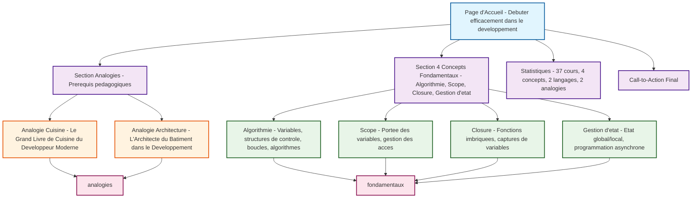

---
*Créé le : 2024-12-19*
*Source : Structure de la page d'accueil restructurée selon le fichier de formation*
# Structure de la Page d'Accueil - Formation IA

## Graphique Mermaid de la Navigation

## Structure de la Page d'Accueil

### **Flux de Navigation**

1. **Page d'Accueil** → Introduction principale avec le message du fichier de formation
2. **Section Analogies** → Prérequis pédagogiques (2 analogies)
3. **Section 4 Concepts** → Les fondamentaux techniques
4. **Statistiques** → Vue d'ensemble (37 cours, 4 concepts, etc.)
5. **Call-to-Action** → Navigation finale

### **Liens Principaux**

- **Analogies** → `/analogies` (Le Grand Livre de Cuisine + Architecture)
- **Concepts Fondamentaux** → `/fondamentaux` (37 cours organisés par concept)

### **Logique Pédagogique**

1. **Comprendre le contexte** (analogies) 
2. **Maîtriser les concepts** (4 fondamentaux)
3. **Pratiquer** (37 cours en parallèle Python/JS/TS)

Cette structure guide l'utilisateur de manière logique : contexte → concepts → pratique.

## Notes de Conception

### **Message Principal**
- Titre : "Débuter efficacement dans le développement : langage, fondamentaux, IA et parcours cohérent"
- Source : Fichier "Formation Les fondamentaux pour coder avec l'IA.md"

### **4 Concepts Fondamentaux**
1. **Algorithmie** - Variables, structures de contrôle, boucles, algorithmes
2. **Scope** - Portée des variables, gestion des accès
3. **Closure** - Fonctions imbriquées, captures de variables
4. **Gestion d'état** - État global/local, programmation asynchrone

### **Analogies Pédagogiques**
- **Le Grand Livre de Cuisine** : Recettes (algorithmes), ingrédients (variables), techniques (patterns)
- **L'Architecte du Bâtiment** : Plans (design), fondations (fondamentaux), étages (couches)

### **Statistiques**
- 37 cours fondamentaux
- 4 concepts fondamentaux
- 2 langages en parallèle (Python/JavaScript/TypeScript)
- 2 analogies pédagogiques

## Tags
#formation-ia #page-accueil #structure #mermaid #analogies #concepts-fondamentaux
