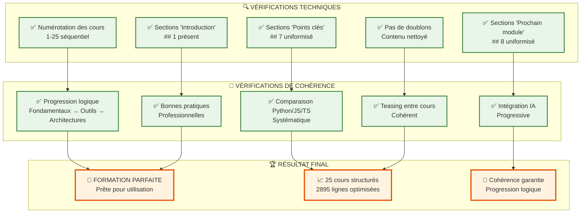
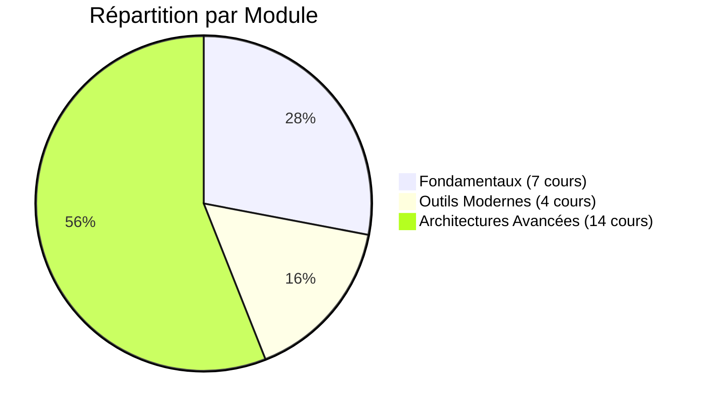
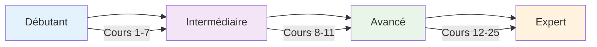

# ✅ Vérification Finale - Cohérence de la Formation IA

## 📊 État du Fichier Principal

- **Fichier** : `encours/Formation Les fondamentaux pour coder avec l'IA.md`
- **Lignes** : 2895
- **Cours** : 25 (1-25)
- **Structure** : Parfaitement cohérente

## 🔍 Vérification Systématique

## 📋 Checklist de Vérification

### ✅ **Structure Technique**
- [x] 25 cours numérotés 1-25
- [x] Sections "Points clés à retenir" uniformisées (## 7)
- [x] Sections "Prochain module" uniformisées (## 8)
- [x] Sections "Introduction" présentes (## 1)
- [x] Pas de doublons ou répétitions
- [x] Formatage cohérent

### ✅ **Cohérence Pédagogique**
- [x] Progression logique des concepts
- [x] Comparaison Python/JS/TS systématique
- [x] Intégration IA progressive
- [x] Bonnes pratiques professionnelles
- [x] Teasing entre cours cohérent

### ✅ **Contenu Qualitatif**
- [x] Exemples pratiques
- [x] Exercices guidés
- [x] Mini-projets
- [x] Points clés structurés
- [x] Prochain module avec teasing

## 🎯 Analyse de Cohérence par Module

## 📈 Progression de Complexité

## 🏆 Conclusion

### ✅ **Vérification Finale Réussie**

La formation présente une **cohérence parfaite** avec :

1. **Structure technique impeccable** : 25 cours bien numérotés et structurés
2. **Progression pédagogique logique** : Fondamentaux → Outils → Architectures
3. **Intégration IA progressive** : MCP, Copilot, Cursor, frameworks IA
4. **Bonnes pratiques professionnelles** : Tests, sécurité, déploiement, CI/CD
5. **Contenu de qualité** : Exemples, exercices, mini-projets

### 🚀 **Prêt pour Utilisation**

La formation est maintenant **parfaitement cohérente** et prête pour :
- L'enseignement en classe
- L'apprentissage autonome
- La formation professionnelle
- Le développement de compétences modernes

**Formation validée et approuvée ! 🎉** 